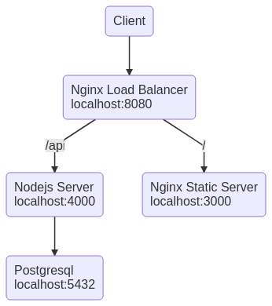

## Infrastructure Schema



## Run full stack

```sh
docker-compose -f docker-compose.stack.yaml -f docker-compose.app.yaml build
docker-compose -f docker-compose.stack.yaml -f docker-compose.app.yaml up -d
```

## Dev workflow

```sh
docker-compose -f docker-compose.stack.yaml up -d

## run server in dev mode
cd server
npm start
npm run fixtures

## run client in dev mode
cd client
npm start
```
